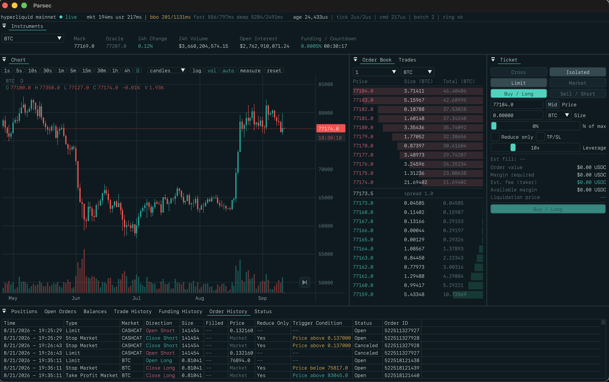

# Parsec

**A fast lightweight trading client for Hyperliquid perpetuals.**

One small binary. No browser, no Electron, no web stack. Keys are kept on your machine.



## Getting started

You need a C++20 compiler and a stable Rust toolchain.

```sh
cmake -S . -B build
cmake --build build
./build/parsec             # mainnet
./build/parsec --testnet   # testnet
```

### Connecting your account

On first launch Parsec asks you to connect an account:

1. Paste your wallet private key and pick a passphrase.
2. Parsec creates a new agent wallet and uses your key for a single signature to approve it.
3. Your key is wiped from memory right away. Only the agent key is saved, encrypted, in
   your `~/.parsec` folder (readable only by you).

After that, you unlock Parsec with your passphrase. Your main key is never stored, logged,
or passed on the command line.

## How it is built

| Part | Language | Job |
|---|---|---|
| Trading core | C++20 | market data, order state, risk, portfolio math |
| Network edge | Rust | WebSocket and REST, message decoding, order signing |
| Interface | Dear ImGui | charts, book, ticket, positions |

The Rust side talks to the C++ side through a small C interface and lock free queues, so the
screen never waits on the network.

Signing is checked against Hyperliquid's official test vectors.

**Direct to the exchange.** Parsec connects straight to Hyperliquid's public API. No hosted
website or third party server sits between you and your orders.

## Tests

```sh
cd rust && cargo test
ctest --test-dir build
```

## Scope

Parsec supports Hyperliquid **perpetuals only**. Spot trading and deposits/withdrawals are not
supported yet.
